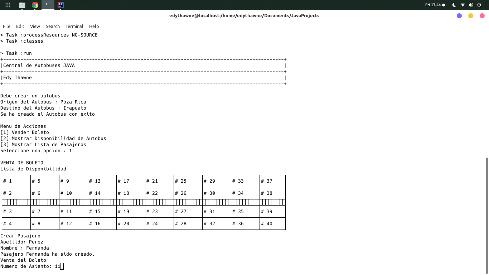
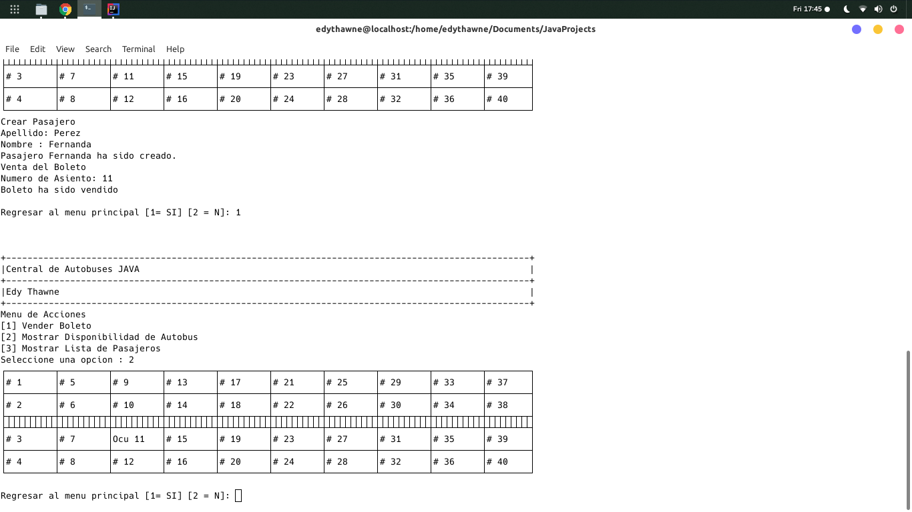
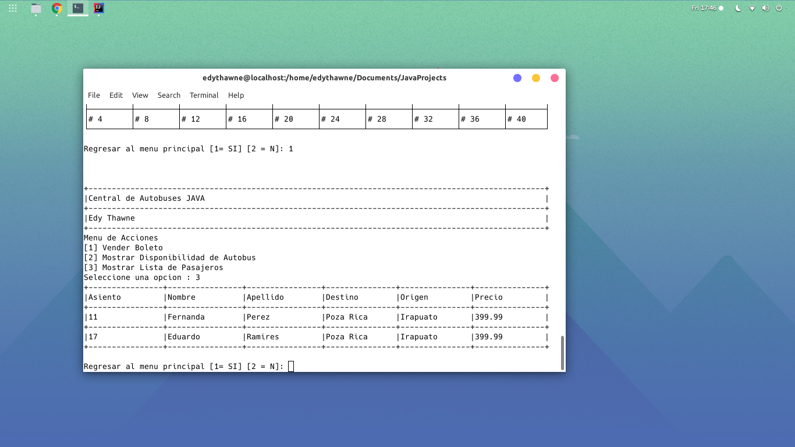

### Simulador de Autobús de Pasajero [JAVA-GRADLE]

El objetivo de este proyecto es realizar la simulación de un autobús de pasajeros con JAVA utilizando los siguientes recursos:
- Programación Orientada a Objet
- Patron de Diseño MVP (Model - View - Presenter)
- [ASCII Table](https://github.com/vdmeer/asciitable)
- Impresiones por Consola (CMD, Terminal)

### Característica
Con el *Simulador de Autobús* usted podrá:
- Crear un Autobus (Autobus Model).
- Crear un Pasajero (Pasajero Model).
- Crear un Boleto (Boleto Model).
- Asignacion y validacion de asiento vendidos.
- Mostrar la información de los asientos vendidos.

### Capturas

- Inicio: Creacion de Autobus y primer pasajero

- Vista del Menu de Opciones

- Vizualizacion de Pasajeros

